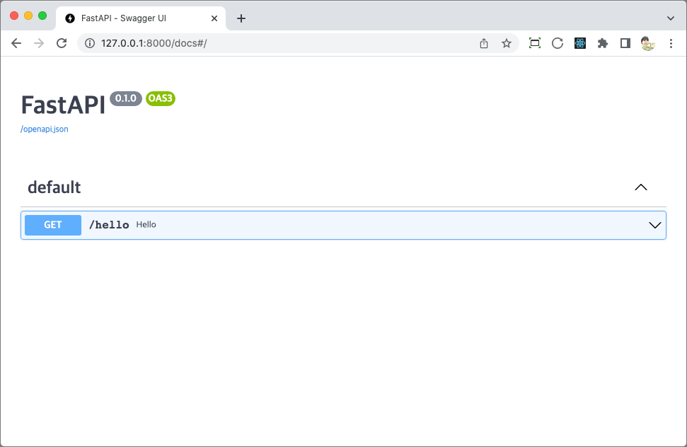

## Hello API 만들기
1. main.py 작성
```python
from fastapi import FastAPI

# FastAPI 클래스로 생성한 app 객체가 바로 FastAPI의 핵심 객체
# 모든 동작은 이 객체로부터 비롯된다.
app = FastAPI() 

# URL 요청이 발생하면 해당 함수를 실행하여 결과를 리턴하라는 의미이다.
# /hello라는 URL이 요청되면 FastAPI는 {"message": "안녕하세요 파이보"}라는 딕셔너리를 리턴할 것이다.
@app.get("/hello")
def hello():
    # hello 함수에서는 딕셔너리를 리턴했지만 FastAPI는 이를 자동으로 json 형태의 응답으로 리턴한다.
    return {"message": "안녕하세요 파이보"}
```

2. FastAPI 서버 실행
   (--reload 옵션은 프로그램이 변경되면 서버 재시작 없이 그 내용을 반영하라는 의미이다.)
```cmd
    uvicorn main:app --reload
```

3. Hello API 테스트하기
```
    http://127.0.0.1:8000/docs
```
