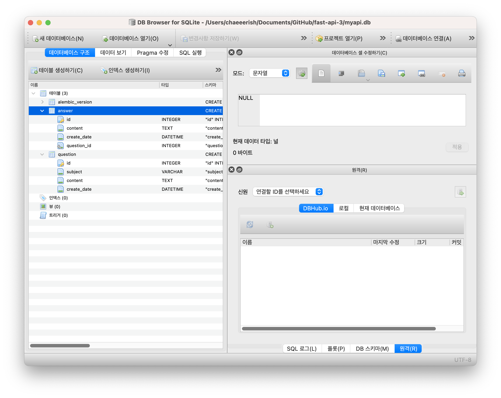

## FastAPI에 ORM 적용하기
database.py
```python
from sqlalchemy import create_engine
from sqlalchemy.ext.declarative import declarative_base
from sqlalchemy.orm import sessionmaker

SQLALCHEMY_DATABASE_URL = "sqlite:///./myapi.db"

# create_engine, sessionmaker 등을 사용하는것은 SQLAlchemy 데이터베이스를 사용하기 위해 따라야 할 규칙이다.
# 커넥션 풀을 생성한다.
# 커넥션 풀이란 데이터베이스에 접속하는 객체를 일정 갯수만큼 만들어 놓고 돌려가며 사용하는 것이다.
engine = create_engine(
    SQLALCHEMY_DATABASE_URL,
    connect_args={"check_same_thread": False}
)

# SessionLocal은 데이터베이스에 접속하기 위해 필요한 클래스이다.
# autocommit=False : 자동으로 데이터베이스에 변경사항이 적용되지 않으므로 rollback으로 되돌리는 것이 가능하다.
SessionLocal = sessionmaker(autocommit=False, autoflush=False, bind=engine)

Base = declarative_base()
```

## 모델 생성하기
question.py
```python
from sqlalchemy import Column, Integer, String, Text, DateTime, ForeignKey
from sqlalchemy.orm import relationship

# Question과 같은 모델 클래스는 database.py에서 정의한 Base 클래스를 상속하여 만들어야 한다.
class Question(Base):
    __tablename__ = "question"

    id = Column(Integer, primary_key=True)
    subject = Column(String, nullable=False)
    content = Column(Text, nullable=False)
    create_date = Column(DateTime, nullable=False)

class Answer(Base):
    __tablename__ = "answer"

    id = Column(Integer, primary_key=True)
    content = Column(Text, nullable=False)
    create_date = Column(DateTime, nullable=False)
    question_id = Column(Integer, ForeignKey("question.id"))
    question = relationship("Question", backref="answers") # relationship의 첫 번째 파라미터는 참조할 모델명이고 두 번째 backref 파라미터는 역참조 설정이다. 역참조란 쉽게 말해 질문에서 답변을 거꾸로 참조하는 것을 의미한다. 한 질문에는 여러 개의 답변이 달릴 수 있는데 역참조는 이 질문에 달린 답변들을 참조할 수 있게 한다. 
```

## 모델을 이용해 테이블 자동으로 생성하기
SQLAlchemy의 alembic을 이용해 데이터베이스 테이블을 자동으로 생성할 수 있다.

alembic 설치 및 초기화
```
pip install alembic // alembic 설치
alembic init migrations // alembic 초기화
```
alembic.ini 파일 수정
```
sqlalchemy.url = sqlite:///./myapi.db
```
env.py 수정
```
import models
target_metadata = models.Base.metadata
```
리비전 파일 생성 및 실행하기
```
alembic revision --autogenerate // 생성
alembic upgrade head // 실행
```

결과
```
myapi.db 파일이 생성되었을 것이다. myapi.db가 바로 SQLite 데이터베이스의 데이터 파일이다.
```

## alembic 없이 테이블 생성하기
main.py 파일에 다음의 문장을 삽입하면 FastAPI 실행시 필요한 테이블들이 모두 생성된다.
```python
import models
from database import engine

models.Base.metadata.create_all(bind=engine)
```
매우 간단한 방법이지만 데이터베이스에 테이블이 존재하지 않을 경우에만 테이블을 생성한다. 한번 생성된 테이블에 대한 변경 관리를 할 수는 없다. 이러한 이유로 이 책에서는 이 방법을 사용하지 않고 alembic을 사용하여 데이터베이스를 관리할 것이다.

